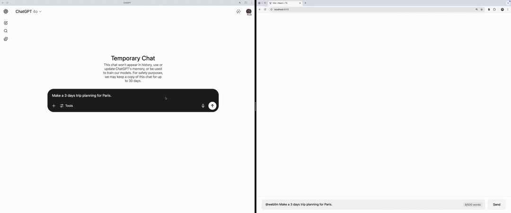

# Running LLMs in the Browser – A Proof of Concept with WebLLM

As AI continues to evolve, the demand for **fast, cost-effective, and privacy-conscious** applications is growing. Traditionally, large language models (LLMs) like ChatGPT run on powerful and expensive backend servers, requiring constant API calls for inference. However, **WebLLM** introduces a new paradigm: running LLMs **directly in the browser** using WebGPU, eliminating the need for cloud-based requests.

This is part of what's being referred to as Web AI, the practice of using machine learning models that run client-side and execute on the user's own device, leveraging web technologies such as JavaScript, WebAssembly, and WebGPU or WebNN for acceleration.

While this technology presents exciting possibilities, it is still in its early stages. In this post, we will walk through our **proof of concept**, discussing its capabilities, limitations, and what improvements are needed for WebLLM to become a viable solution for production applications.

## What is WebLLM?

[WebLLM](https://github.com/mlc-ai/web-llm) is a framework that enables **local execution of LLMs within the browser** using WebGPU acceleration. Instead of relying on external servers, users can download a **compact model**, such as **Llama 3 (8 billion parameters)**, and perform inference directly on their machines.

If you're curious how WebLLM works, here is a high-level overview:

- To achieve high performance for the computationally intensive LLM workloads, WebLLM compiles performant WebGPU kernels by leveraging 2 other libraries under the hood.
- WebGPU acts as an abstraction layer, allowing a single kernel to run efficiently across different GPUs (NVIDIA, AMD, Apple Metal) without needing separate implementations for each.
- WebLLM compiles model weights and a WebAssembly (Wasm) library containing these WebGPU kernels ahead of time; these are then downloaded and cached by the browser.
- The authors of the tool have measured that WebGPU kernels can maintain approximately 85% of native performance. You can read more about it here.

### Key Considerations:

- **Hardware dependency** – Requires a GPU-compatible browser and adequate system resources. Not all browsers support [WebGPU](https://developer.mozilla.org/en-US/docs/Web/API/WebGPU_API), which can limit accessibility and performance across different devices.
- **Mobile device limitations** – WebLLM is currently **not supported on iPhones and most Android devices**, making it less accessible for mobile applications.
- **Inference performance** – While functional, it is not yet as reliable as larger cloud-hosted models.

## First-Time User Experience

One of the key challenges with WebLLM is the **initial setup**.

- **Large model downloads** can be time-consuming, depending on internet speed. In our case, the initial download took over a couple of minutes, which could vary based on network conditions and hardware capabilities, such as:

| Region                 | Download Time     | Notes                                                   |
| ---------------------- | ----------------- | ------------------------------------------------------- |
| EU (1 Gbps fibre)      | roughly 30 s      | 700 MB delivered at about 730 Mbps on an MacBook Pro    |
| Brazil (50 Mbps cable) | roughly 3–4 min   | Same hardware, consumer-grade link                      |
| Rural 4 G (12 Mbps)    | roughly 20–45 min | Worst-case scenario we could reproduce                  |

- Once the bundle lands, the browser persists it in **[IndexedDB](https://developer.mozilla.org/en-US/docs/Web/API/IndexedDB_API)**. We considered the File System Access API for faster look-ups, but the extra security prompts would have added friction to the onboarding flow. For our PoC the IndexedDB read on page refresh felt acceptable while production apps may opt for a [service worker](https://developer.mozilla.org/en-US/docs/Web/API/Service_Worker_API) cache or a hidden “warming” tab to hide that delay. While caching improves long-term usability, the onboarding experience needs refinement for broader adoption. 

- **Background fetch pattern** – imagine a single-page enterprise app that users spend several minutes configuring before invoking any AI features. A service worker can silently pre-download the WebLLM bundle during those “thinking” minutes, avoiding a blocking spinner when the user finally clicks *Chat with AI*. The same worker could house-keep older model versions to stay within storage quotas.

## The Proof of Concept

We built a **React-based chat interface** that decides on every prompt whether to call **WebLLM** or **OpenAI’s GPT-4o**, and removes personally identifiable information (PII) from user queries in the case they are sent to OpenAI's cloud-based service. Decision logic lives in a lightweight WebLLM engine running on the browser with browser GPU optimzed models:

1. The user sends a message in the chat interface.
2. The WebLLM engine in the React code redacts people's or organizations' names. The original text never leaves the browser memory.
3. The redacted prompt is sent to either to WebLLM (local inference) **or** to OpenAI, based on complexity analysis done by another webllm prompt.
4. The response returns to the browser (when sent to Open AI), which re-injects placeholders for readability and streams it to the client.

### Complexity Analyzer - How it works

1. **Simple queries** (“What’s the capital of France ?”) never cross the network; WebLLM answers locally and quickly.
2. **Complex or multi-paragraph prompts** are forwarded to GPT-4o, ensuring parity with our existing chatbot quality bar.
3. Users can override the auto-selection by prefixing `@webllm` or `@openai`.

This hybrid flow achieves a sweet spot: **cost savings** on low-value prompts, **quality** on high-value ones, and **privacy** via in-browser redaction.

## Challenges and Limitations

### Prompt for Complexity Analysis

To determine whether a query should be handled by WebLLM or OpenAI, we implemented the following prompt:

```
Role: Prompt Complexity Rater  
Context: You receive exactly one user prompt.  
Goal: Return a complexity score from 1 to 5 using the rubric below.  
Rubric  
* 1 Very simple – single fact, trivial lookup  
* 2 Simple – short answer, light reasoning  
* 3 Moderate – some domain terms or two-step reasoning  
* 4 Hard – multi-step reasoning or long context  
* 5 Very hard – deep domain knowledge or several subtasks  

Process  
1. Classify the prompt against the rubric.  
2. Output ONLY the JSON object:  
  {"score": <integer 1-5>, "explanation": "<max 100 words>"}

Rules  
* If torn between two scores pick the higher one.  
* Do not reveal chain of thought or extra text.
* Write a comprehensive explanation of the score in less than 100 words that deeply explains your reasoning and decision.  
* If as part of the reason you return an error, please explain the error in the explanation field.
```

While WebLLM introduces a compelling approach to local inference, it remains **unpredictable** in certain cases.

For example, when asked:
👉 *“What is the sum of 2 + 2?”*

Instead of processing this simple arithmetic question locally, WebLLM **classified it as complex** and forwarded it to OpenAI’s API. The inconsistency in inference logic highlights areas that require further optimization.

However, this **unreliability is more related to the smaller models** than to WebLLM itself. Even if the same smaller models were running server-side, we would likely see similar unpredictability in responses. This erratic behavior was also noted in the redaction process, which often missed the full name of people or organizations and wasn't able to redact it, especially when more than one name was sent in the prompt.

Additionally, performance varies significantly based on hardware capabilities, making standardization across user environments a challenge.

## Enhancing Control with Mentions

To improve user experience, we implemented a **mention-based system**:

- If a user types `@webllm`, the system **forces WebLLM to generate the response**.
- Without a mention, the system dynamically selects either WebLLM or OpenAI.

This gives users greater control over inference execution and helps mitigate some of the unpredictability in query classification.

## Potential Future Use Cases

While WebLLM is still evolving, several **real-world applications** could emerge as it matures:

- **Offline AI Applications** – Running WebLLM in offline mode on installed browsers or mobile apps would enable AI-powered interactions in areas with **no internet access**. However, running WebLLM on mobile devices presents significant challenges due to memory constraints. One user reported: "Nice, had to enable experimental WebGPU in chrome://flags on my Samsung Galaxy S24, but then it worked. Unfortunately, 8GB RAM seems not enough for loading a 4GB model because OS and apps already occupy more than 4GB. The chat crashes while loading the model from cache." This highlights the need for optimizations in model size and memory management for broader adoption on mobile platforms.

- **Smaller, Task-Specific Models** – One way to address the memory constraint issue reported by users is by using **smaller, goal-oriented models** that are optimized for specific tasks. Instead of running a single large model, deploying multiple lightweight models tailored for different functionalities could improve efficiency and usability on resource-constrained devices.

- **Writing Assistance Tools** – WebLLM could power a **privacy-first** browser extension for tasks like text rephrasing, grammar correction, or auto-suggestions.

- **Summarization of Web Content** – Users could highlight text on a webpage to generate concise summaries. A browser extension with a **chat-based interface** could enhance interactivity by answering user-specific questions about the content.


## Code Examples from the Proof of Concept

### Model Configuration:

```javascript
export const MODEL = {
  DEFAULT_CONFIG: {
    MODEL: 'gpt-4',
    TEMPERATURE: 0.3,
    MAX_TOKENS: 1000,
    API_URL: 'https://api.openai.com/v1/chat/completions'
  },
  AVAILABLE_MODELS: [
    { value: 'gpt-4', label: 'GPT-4' },
    { value: 'Hermes-2-Pro-Llama-3-8B-q4f16_1-MLC', label: 'Hermes 2 Pro' }
  ],
  WEB_LLM: {
    DEFAULT_MODEL: 'Llama-3.2-1B-Instruct-q4f32_1-MLC',
    MODEL_URL: 'https://huggingface.co/mlc-ai/Llama-3.2-1B-Instruct-q4f32_1-MLC',
    MODEL_LIB: 'https://raw.githubusercontent.com/mlc-ai/binary-mlc-llm-libs/main/web-llm-models/v0_2_48/Llama-3.2-1B-Instruct-q4f32_1-ctx4k_cs1k-webgpu.wasm',
    VRAM_REQUIRED_MB: 1128.82,
    CONTEXT_WINDOW_SIZE: 4096
  }
};

// Chat Constants
export const CHAT = {
  MAX_TOKENS: 500,
  MESSAGE_SOURCE: {
    USER: 'user',
    AI: 'ai',
    ANALYZING: 'analyzing'
  }
};
```

### Creating the WebLLM Component:

```javascript
CreateMLCEngine(MODEL.WEB_LLM.DEFAULT_MODEL, { 
      initProgressCallback,
      appConfig: {
        // This is key for performance
        useIndexedDBCache: true, 
        model_list: [
            { 
              model: MODEL.WEB_LLM.MODEL_URL,
              model_id: MODEL.WEB_LLM.DEFAULT_MODEL,
              model_lib: MODEL.WEB_LLM.MODEL_LIB,
              vram_required_MB: MODEL.WEB_LLM.VRAM_REQUIRED_MB,
              low_resource_required: true,
              overrides: {
                context_window_size: MODEL.WEB_LLM.CONTEXT_WINDOW_SIZE,
              },
            },
        ],
      }
     }).then(engine => {  
      setEngine(engine);
      setReady(true);
    }).catch(error => {
      console.error('Error initializing WebLLM:', error);
    });
```

### Chat Handling:
The chat handling is easy to configure. WebLLM is designed to be fully compatible with [OpenAI API](https://platform.openai.com/docs/api-reference/chat), so it will feel familiar to developers who already have experience with that.
```javascript
const chatMessages = [
    { role: "system", content: "You are a helpful AI assistant." },
    ...currentMessages.map(msg => ({
      role: msg.isUser ? "user" : "assistant",
      content: msg.text
    })),
    { role: "user", content: message }
];

const chunks = await engine.chat.completions.create({
    messages: chatMessages,
    temperature: 0.3,
    max_tokens: 1000,
    stream: true
});

let streamedText = '';
for await (const chunk of chunks) {
    streamedText += chunk.choices[0]?.delta.content || '';
    onUpdate(streamedText);
}
```

### Complexity Analysis

In the code below, we use the **Complexity Rater Prompt** mentioned in a previous [section](#prompt-for-complexity-analysis). We also get structured output from the model using a [zod](https://www.npmjs.com/package/zod) schema in the `response_format` option from the chat engine.

```javascript
export const useComplexityAnalysis = (engine: MLCEngine | null) => {
  const analyzeComplexity = useCallback(async (userQuery: string): Promise<ComplexityAnalysis> => {
    if (!engine) {
      throw new Error('WebLLM engine not initialized');
    }

    try {

      const response = await engine.chat.completions.create({
        messages: [
          { role: "system", content: `/* Complexity Rater Prompt... */` },
          { role: "user", content: `User query: ${userQuery}` }
        ],
        temperature: 0,
        max_tokens: 200,
        response_format: {
          type: 'json_object',
          schema: JSON.stringify(zodToJsonSchema(
            z.object({ score: z.number().min(1).max(5), explanation: z.string() })
          )),
        },
      });

      const { score, explanation } = JSON.parse(response.choices[0]?.message?.content || '');

      console.log('Complexity analysis response:', { score, explanation });

      if (!score || !explanation) {
        throw new Error('Invalid analysis format');
      }

      return { llm: score < 3 ? 'webllm' : 'openai', explanation };

    } catch (error) {
      console.error('Error analyzing complexity:', error);
      return {
        llm: 'webllm',
        explanation: 'Error during complexity analysis'
      };
    }
  }, [engine]);

  return { analyzeComplexity };
}; 
```

### Real-world latency side-by-side

Below is a short screen-capture comparing our PoC (right pane, running WebLLM locally) with the standard ChatGPT interface (left pane, hitting the cloud). The prompt is fired at the exact same time on both sides.



What you can’t unsee:

* **WebLLM streams its first tokens in under a second.**  
* **ChatGPT sits on “Thinking…” for ~8 s before any text appears**, even on a solid fibre connection.  
* Once both models are “warm,” generation speeds converge, but the *time-to-first-token* advantage of running inference in-browser is hard to beat.

This clip reinforces an earlier point: when the model is already cached locally, WebLLM can deliver near-instant responses—a game-changer for UX in bandwidth-constrained or privacy-sensitive environments.


## Possible Enhancements

A key enhancement that can explored is **fine-tuning a model specifically for PII redaction** as a privacy feature. This would enable WebLLM to preprocess user queries by removing sensitive details before sending them to an external API like OpenAI. By automatically detecting and replacing personally identifiable information (PII) with placeholders, we can ensure compliance with privacy regulations such as GDPR and HIPAA while maintaining response accuracy. This capability would be particularly useful in industries like healthcare, finance, and legal services where data security is critical.

## What’s Next?

We’ll keep a close watch on WebLLM’s roadmap—tracking performance fixes, mobile-browser coverage, and smaller-footprint model releases. When the tech reaches a point where latency and stability are production-grade, we’ll dive back in, harden the PoC, and publish new findings on integrating browser-side inference into real apps.

Web-executed LLMs remain an exciting frontier that could upend how AI-powered front-end architectures work, shifting costs and privacy guarantees toward the user’s device.


